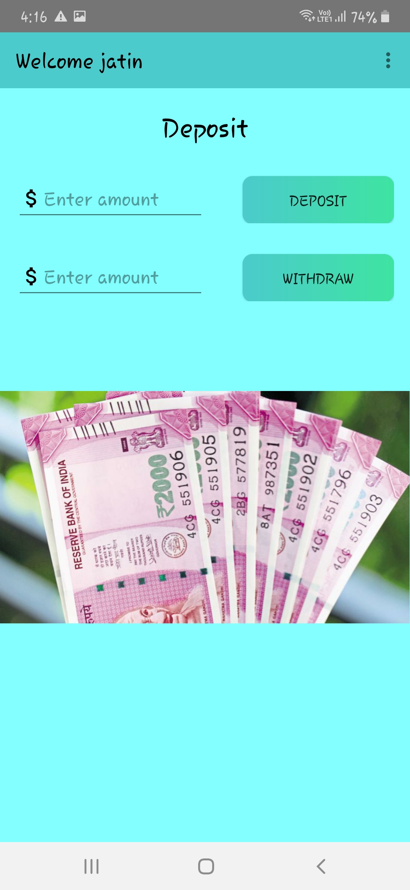

# Bank Simulation

Bank Simulation is a simple fun app which simulates basic bank functions like deposit, withdraw money. One can also check transaction history of his account.

## Screenshots

<table>
  <tr>
    <td></td>
    <td></td>
    <td></td>
  </tr>
 <tr>
    <td></td>
    <td></td>
    <td></td>
  </tr>
  <tr>
    <td></td>
    <td></td>
    <td></td>
  </tr>
</table>

## Development

Java is used to develop this native android app.

### Backend Used

- Firebase is used for backend purposes.

## License

License.
